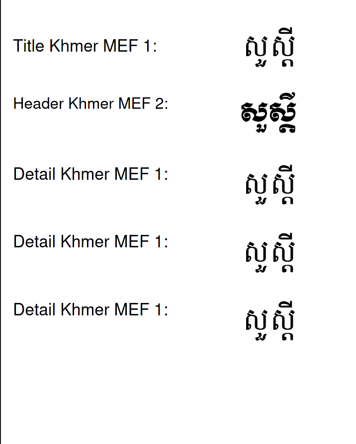

# Import Project
- Import project into intellij
- File -> Project Structure -> Module -> Dependencies -> Add lib folder as Jars or Directories

# Sample Generated PDF

# Generated Report Path
Find at: `src/generate-khmer-font.pdf`